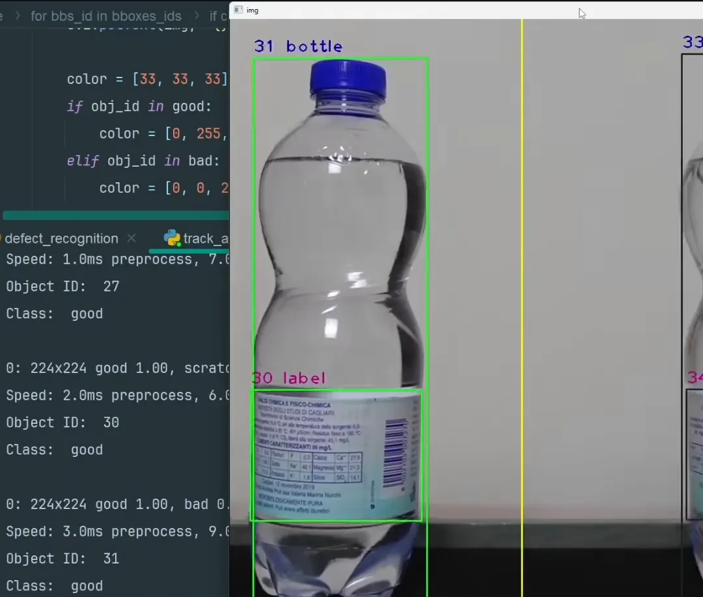

# AI-Powered Product Quality Inspection Web App



## Overview

The AI-Powered Product Quality Inspection Web App is an open-source solution for manufacturers and production facilities to automate quality control using computer vision. This application provides real-time detection and classification of products on a production line, helping businesses improve quality assurance processes, reduce defects, and optimize operations.

## Features

- **Live Camera Integration**: Connect to production line cameras to monitor and inspect products in real-time
- **AI-Powered Defect Detection**: Automatically identify and classify products as "good" or "bad" based on configurable criteria
- **Quality Statistics Dashboard**: Track inspection metrics including pass/fail rates and processing speed
- **Product Management**: Configure different product types with specific inspection criteria
- **Custom Model Training**: Upload sample images to train the detection model for specific products
- **Comprehensive Reporting**: Generate and export reports in PDF and Excel formats
- **Data Persistence**: Save inspection data and configurations locally

## Technology Stack

- **Frontend**: React.js with Tailwind CSS for responsive design
- **Computer Vision**: JavaScript-based image processing with canvas manipulation
- **Data Visualization**: Recharts for interactive charts and graphs
- **Export Functionality**: PDF and Excel report generation
- **Icons & UI Components**: Lucide React icons, custom components

## Getting Started

### Prerequisites

- Node.js (v14 or newer)
- NPM or Yarn
- Modern web browser with camera access support

### Installation

1. Clone the repository:
```bash
git clone https://github.com/liveupx/AI-Powered-Product-Quality-Inspection-Web-App.git
cd AI-Powered-Product-Quality-Inspection-Web-App
```

2. Install dependencies:
```bash
npm install
# or
yarn install
```

3. Start the development server:
```bash
npm start
# or
yarn start
```

4. Open your browser and navigate to `http://localhost:3000`

## Usage

### Setting Up Products

1. Navigate to the "Products Setup" page
2. Click "Add New Product" and fill in the product details
3. Upload sample images of both good and defective products
4. Train the detection model

### Starting Inspection

1. Go to the "Live Inspection" page
2. Connect your camera by clicking "Start Inspection"
3. Position the camera to view the production line
4. The system will automatically detect and classify products

### Generating Reports

1. Navigate to the "Reports" page
2. Set the desired date range
3. Click "Export PDF" or "Export Excel" to download reports

## Deployment

For production deployment:

```bash
npm run build
# or
yarn build
```

This creates a `build` folder with optimized production files that can be deployed to any static hosting service.

## Customization

### Detection Algorithm

The core detection algorithm is located in the `LiveView` component. You can customize it by:

1. Modifying the color thresholds for different types of products
2. Adjusting the region of interest parameters
3. Implementing more sophisticated computer vision techniques

### Adding New Features

The modular architecture makes it easy to add new features:

- Additional dashboard widgets in the `Dashboard` component
- New report types in the `Reports` component
- Enhanced product configuration options in the `ProductConfig` component

## Contributing

Contributions are welcome! Please feel free to submit a Pull Request.

1. Fork the repository
2. Create your feature branch (`git checkout -b feature/amazing-feature`)
3. Commit your changes (`git commit -m 'Add some amazing feature'`)
4. Push to the branch (`git push origin feature/amazing-feature`)
5. Open a Pull Request

## License

This project is licensed under the MIT License - see the [LICENSE](LICENSE) file for details.

## Acknowledgments

- The UI design is inspired by modern manufacturing control systems
- Icons provided by [Lucide Icons](https://lucide.dev/)
- Special thanks to all contributors and the open-source community

## Roadmap

- [ ] Backend integration with Node.js/Express
- [ ] Database storage with MongoDB
- [ ] Advanced AI model integration (TensorFlow.js)
- [ ] User authentication and role-based access
- [ ] Multi-camera support
- [ ] Mobile app version
- [ ] API for integration with ERP systems

## Contact

Project Link: [https://github.com/liveupx/AI-Powered-Product-Quality-Inspection-Web-App](https://github.com/liveupx/AI-Powered-Product-Quality-Inspection-Web-App)
